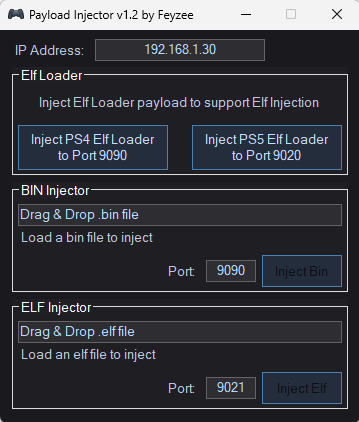

# Payload Injector v1.1

**Payload Injector** — A lightweight Windows (C# WinForms) tool for sending ELF/BIN payloads to PlayStation 4 and PlayStation 5 consoles over a local network.

  

---

## Overview

This project was built using **Visual Studio 2012** and targets **.NET Framework 4.0**. It provides an easy-to-use interface for injecting payloads to PS4 and PS5 systems via TCP. The application supports drag & drop for file selection and allows manual configuration of target IP address and port.

> **Disclaimer:** The developer assumes **no responsibility** for any potential damage, data loss, or issues that may occur on your PlayStation console as a result of using this software. Use it at your own risk and only on your own devices, within legal boundaries.

---

## Features

* Drag & Drop support and separate injection controls for `.elf` and `.bin` files
* Manual input for target IP address and port
* Integrated ELF loader for PS4 and PS5
* Built-in ping check before establishing connection
* Default transfer packet size reduced to **8 KB** to improve reliability over unstable networks
* Clean, dark-themed interface

---

## ToDo List

* PS5 support & tests (binloader & elfloader requirements?)

---

## Requirements

* Windows operating system
* Visual Studio 2012 or higher (recommended for building)
* .NET Framework 4.0

---

## Build Instructions

1. Clone or download this repository.
2. Open the solution in **Visual Studio**.
3. Make sure the target framework is set to **.NET Framework 4.0**.
4. Build the project via `Build -> Build Solution`.

> Note: Opening the project in a newer version of Visual Studio (e.g., 2015/2017/2019) may prompt to upgrade the solution. If you wish to keep compatibility, ensure the framework remains at version 4.0 in project settings.

---

## Usage

1. Launch the application.
2. Enter your target PlayStation’s IP address in the `IP Address` field.
3. Drag & drop your ELF or BIN file into the appropriate area — the filename and file size will appear automatically.
4. Verify the port number (default values are pre-filled).
5. Click the `Inject` button to start sending the payload.

> This project can be used to **send and execute the AirPSX ELF payload**, available at [AirPSX GitHub Repository](https://github.com/barisyild/airpsx).

---

## Security & Disclaimer

* Sending invalid or incompatible payloads may cause your console to crash, reboot, or become unresponsive.
* Always verify payload integrity and comply with applicable laws when using or distributing this software.

---

## Contributing

Contributions are welcome! Feel free to open pull requests for bug fixes, UI improvements, or additional features.

---

## Acknowledgments

Special thanks to:

* [barisyild](https://github.com/barisyild) for the [AirPSX](https://github.com/barisyild/airpsx) project, which this tool can be used to launch the ELF payload for.
* [PS4 Payload Dev Organization](https://github.com/ps4-payload-dev) for providing the open-source elfldr project, which serves as the core ELF loader used in this application.

---

## License

This project is licensed under the **GNU General Public License v3.0 (GPL-3.0)**.
See the [LICENSE](LICENSE) file for more information.

---

### Contact

For questions or issues, please open a GitHub issue on this repository.

---
